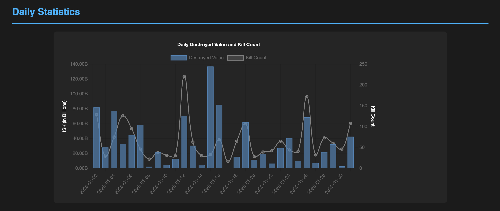
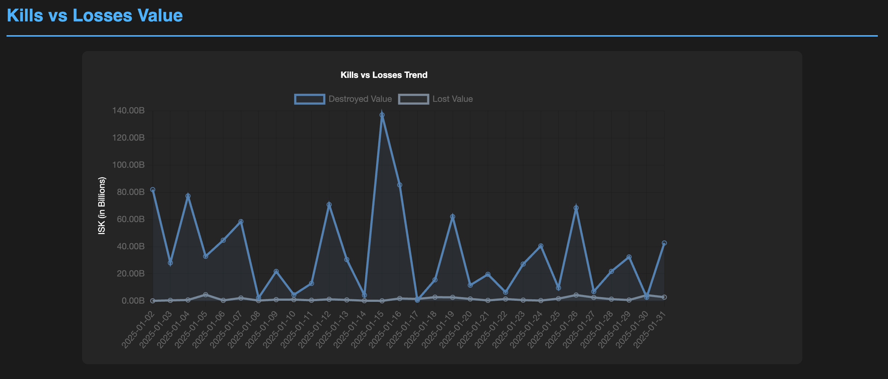
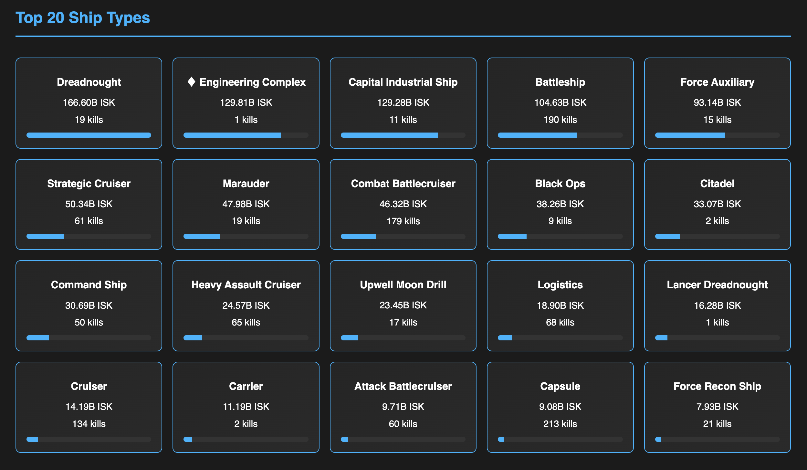
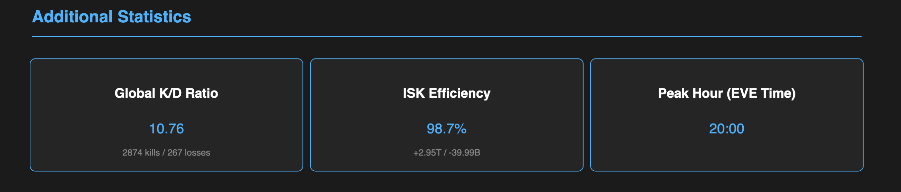
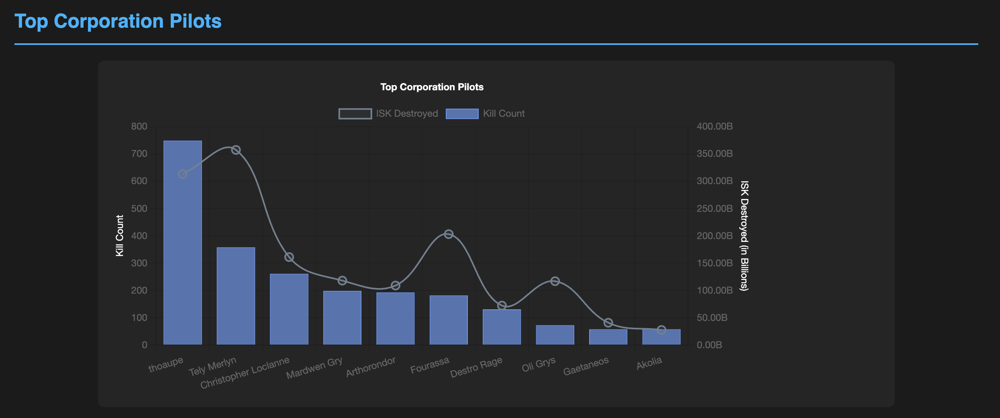

# EVE Online Killmail Tracker

A Python tool to fetch and store EVE Online corporation killmails using zKillboard and ESI (EVE Swagger Interface) APIs.

## Features

- **Automatic Killmail Retrieval**  
  Fetches killmails for a specific corporation using both historical and update modes:
  - *Historical mode*: Fetches kills up to January 1st, 2025
  - *Update mode*: Fetches only new kills since the last update

- **Database Storage**  
  Uses PostgreSQL for storing detailed killmail data including:
  - Solar systems
  - Ship types and specific ships
  - Pilots and corporations (for both victims and attackers)
  - Detailed attacker information

- **Robust API Handling**  
  Implements intelligent backoff to handle API rate limits, with robust error handling and detailed logging.

- **HTML Report Generation**  
  Generates monthly HTML reports with various statistical views:
  - **Daily Statistics:** Displays destroyed value and kill count per day.
  - **Kills vs Losses Trend:** Shows the trend of destroyed vs lost ISK (values are shown in billions).
  - **Top 20 Ship Types:** KPI boxes with dynamic mouse-over effects.
  - **Top Corporation Pilots:** Displays the top pilots with scales in billions.
  - **Additional Statistics:** Includes Global K/D Ratio, ISK Efficiency, and Peak Hour.












- **Automation and Backup**  
  Provides shell scripts for automated execution:
  - `run_killmail.sh`: Runs the main killmail fetching script.
  - `run_report.sh`: Generates the monthly HTML report, updates an index page, and copies the files to a web directory.
  - `backups.sh`: Creates backups of the database and scripts, transfers them to a remote host, and cleans up old backups.

## Prerequisites

- Python 3.8+
- PostgreSQL 14+
- Python packages as listed in `requirements.txt`

## Installation

1. **Clone the repository:**
   ```bash
   git clone git@github.com:cchopin/zkill_batch.git
   cd zkill_batch
   ```

2. **Install Python dependencies:**
   ```bash
   pip install -r requirements.txt
   ```

3. **Create a .env file in the project root with the following variables:**
   ```
   DB_NAME=eve_killmails
   DB_USER=your_user
   DB_PASSWORD=your_password
   DB_HOST=localhost
   DB_PORT=5432
   CORPORATION_ID=your_corp_id
   ```

4. **Initialize the database:**
   ```bash
   psql -U postgres -f sql/eve_killmails.sql
   ```

5. **Make automation scripts executable:**
   ```bash
   chmod +x backups.sh run_killmail.sh run_report.sh
   ```

## Database Structure

The enhanced database schema includes the following tables:
- systems: Solar system information
- ship_types: Ship type classifications
- ships: Specific ship information
- pilots: Pilot data
- corporations: Corporation information
- killmails: Main killmail data
- killmail_attackers: Detailed attacker information

See sql/schema.mmd for the complete entity relationship diagram.

## Usage

### Main Script

To fetch and process killmails, run:
```bash
python main.py
```

This script will:
- Connect to the database.
- Determine the correct mode (historical or update).
- Fetch killmails from zKillboard.
- Enrich data via the ESI API.
- Store results in the PostgreSQL database.

### HTML Report Generation

The report generator produces monthly HTML reports stored in the html/ directory (e.g. 202501.html for January 2025) and an index.html page listing all reports since January 2025. Each report page includes a "Back to Index" link.

### Automation Scripts

**Backup Script:**
```bash
./backups.sh
```
Performs:
- Database dump with gzip compression.
- Script directory archiving.
- Remote backup transfer and cleanup.

**Killmail Fetch Script:**
```bash
./run_killmail.sh
```
Runs the main killmail fetching process within a virtual environment.

**Report Generation Script:**
```bash
./run_report.sh
```
Executes the report generator for the previous month, copies the generated report and index to /var/www/news.eve-goats.fr/, and logs the execution.

### Historical Migration Scripts

The repository also includes historical migration scripts (for reference only):
- backfill_attackers.py: Populates the killmail_attackers table.
- backfill_corporations.py: Updates corporation information in existing killmails.

```bash
python backfill_attackers.py
python backfill_corporations.py
```

## Development Mode

Create a virtual environment:
```bash
python -m venv venv
source venv/bin/activate  # On Unix/macOS
venv\Scripts\activate     # On Windows
```

Install development dependencies:
```bash
pip install -r requirements.txt
```

## Error Handling

Comprehensive error handling is implemented for:
- API connection issues and rate limiting (with intelligent backoff)
- Database connection problems
- Data parsing errors
- Missing or invalid data

## Logging

Logs are stored in the logs/ directory with a unique log file for each execution. These logs contain detailed information about:
- Script execution status
- API requests and responses
- Database operations
- Error conditions and handling

## Contributing

1. Fork the project.
2. Create your feature branch (git checkout -b feature/amazing-feature).
3. Commit your changes (git commit -am 'Add amazing feature').
4. Push to the branch (git push origin feature/amazing-feature).
5. Open a Pull Request.

## Contact

For questions or suggestions, please open an issue on GitHub.

## Acknowledgments

- EVE Online for providing the ESI API.
- zKillboard for their public API.
- The EVE Online development community.

---
