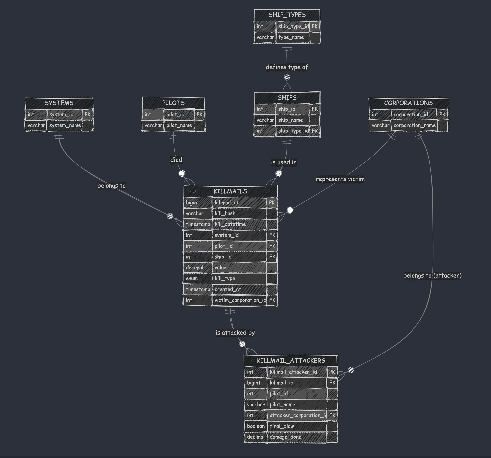

# EVE Online Killmail Tracker

A Python tool to fetch and store EVE Online corporation killmails using zKillboard and ESI (EVE Swagger Interface) APIs.

## Features

- Automatic killmail retrieval for a specific corporation
- Support for both historical and update modes:
  - Historical mode: Fetches kills up to January 1st, 2025
  - Update mode: Fetches only new kills since last update
- PostgreSQL database storage with enhanced schema
- Detailed attacker information tracking
- Corporation tracking for both victims and attackers
- API rate limit handling with intelligent backoff
- Robust error handling and detailed logging
- Data backfill utilities for database schema updates
- HTML report generation capabilities (in development)
- Automated backup and execution scripts

## Prerequisites

- Python 3.8+
- PostgreSQL 14+
- Python packages listed in `requirements.txt`

## Installation

1. Clone the repository
```bash
git clone git@github.com:cchopin/zkill_batch.git
cd zkill_batch
```

2. Install Python dependencies
```bash
pip install -r requirements.txt
```

3. Create a `.env` file in the project root with the following variables:
```plaintext
DB_NAME=eve_killmails
DB_USER=your_user
DB_PASSWORD=your_password
DB_HOST=localhost
DB_PORT=5432
CORPORATION_ID=your_corp_id
```

4. Initialize the database
```bash
psql -U postgres -f sql/eve_killmails.sql
```

5. Make automation scripts executable
```bash
chmod +x backup.sh run.sh
```

## Database Structure

The database schema has been enhanced to include:

- `systems`: Solar system information
- `ship_types`: Ship type classifications
- `ships`: Specific ship information
- `pilots`: Pilot data
- `corporations`: Corporation information
- `killmails`: Main killmail data
- `killmail_attackers`: Detailed attacker information

See `sql/schema.mmd` for the complete entity relationship diagram.



## Usage

### Main Script

Run the main script to fetch and process killmails:
```bash
python main.py
```

The script will:
1. Connect to the database
2. Determine the appropriate mode (historical or update)
3. Fetch killmails from zKillboard
4. Enrich data through the ESI API
5. Store results in the PostgreSQL database

### Automation Scripts

The project includes two automation scripts:

#### Backup Script
```bash
./backup.sh
```
This script performs:
- Creates a temporary backup directory
- Dumps and compresses the PostgreSQL database
- Archives the project scripts
- Transfers backups to a specified Mac host (if accessible)
- Cleans up temporary files

To configure the backup destination, update the following variables in `backup.sh`:
```plaintext
MAC_USER="your_mac_username"
MAC_HOST="your_mac_hostname"
```

#### Execution Script
```bash
./run.sh
```
This script automates the execution process by:
- Setting the correct working directory
- Activating the Python virtual environment
- Running the main script
- Deactivating the virtual environment

### Historical Migration Scripts

The repository includes two historical migration scripts that were used during the database schema update:

1. `backfill_attackers.py`: Script used to populate the killmail_attackers table when it was first introduced
2. `backfill_corporations.py`: Script used to add corporation information to existing killmails

Note: These scripts are kept for historical reference and documentation purposes. They are not needed for new installations as the current database schema already includes all necessary tables and relationships.

```bash
python backfill_attackers.py
python backfill_corporations.py
```

## Development Mode

To set up a development environment:

1. Create a virtual environment:
```bash
python -m venv venv
source venv/bin/activate  # On Unix/macOS
venv\Scripts\activate     # On Windows
```

2. Install development dependencies:
```bash
pip install -r requirements.txt
```

## Error Handling

The application includes comprehensive error handling for:
- API connection issues
- Rate limiting with intelligent backoff
- Database connection problems
- Data parsing errors
- Missing or invalid data

## Logging

Logs are stored in the `logs/` directory and contain detailed information about:
- Script execution status
- API requests and responses
- Database operations
- Error conditions and handling

## Contributing

1. Fork the project
2. Create your feature branch (`git checkout -b feature/amazing-feature`)
3. Commit your changes (`git commit -am 'Add amazing feature'`)
4. Push to the branch (`git push origin feature/amazing-feature`)
5. Open a Pull Request

## Contact

For questions or suggestions, please open an issue on GitHub.

## Acknowledgments

- EVE Online for providing the ESI API
- zKillboard for their public API
- The EVE Online development community